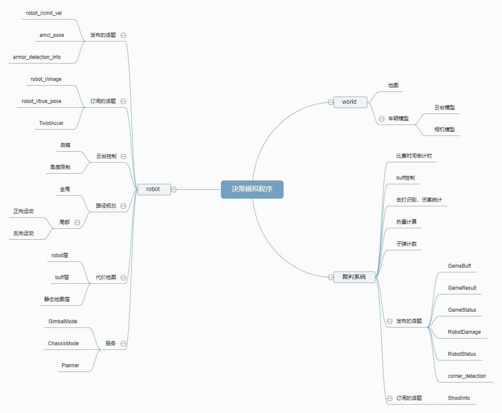

# HITSZ-ICRA-2020 模拟比赛节点
本节点需配合决策节点`robot_decision`使用，主要功能是为决策节点提供一个线上虚拟的模拟环境，方便决策节点的开发。

## 编译
由于本节点需要链接`robot_costmap`和`robot_planning`的动态库，所以需要与这两个节点一起编译。另外本节点还依赖于`robot_msgs`，请在编译前保证有这三个节点。
```bash
catkin_make -DCATKIN_WHITELIST_PACKAGES="robot_costmap;robot_planning;decision_simulate"
```

## 运行
```bash
roslaunch decision_simulate robot_decision_simulation.launch
```

### 已有功能：
* 场地模拟
* 云台自瞄
* 云台角度限制
* 底盘控制
* 代价地图
* 路径规划

### 待完成功能：
* 裁判系统逻辑

## 程序框架
